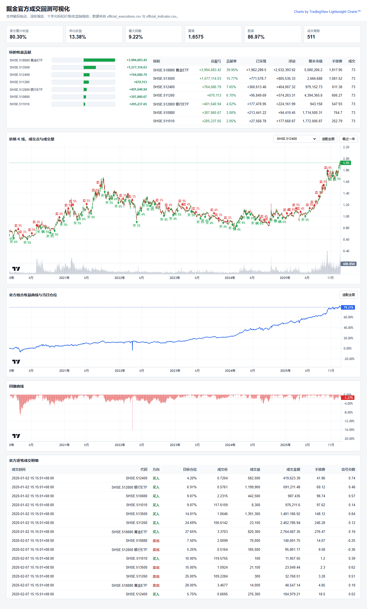

# Trading Backtest Visualizer

一个基于 TradingView Lightweight Charts 的交易回测可视化前端示例。

这个仓库保留可展示的前端框架、脱敏后的示例数据，以及可公开的本地回测数据转换流程。不包含策略训练、参数搜索、掘金 token、缓存或本地大规模研究输出。

## 功能

- K 线、成交点和成交量联动展示
- 鼠标悬停查看 K 线 OHLCV 信息
- 鼠标悬停成交点查看买卖成交信息
- 官方组合收益曲线、回撤曲线和仓位提示
- 逐笔成交列表点击联动图表
- 各标的收益贡献概览
- 支持通过 `?data=...` 加载不同回测版本的 payload

## 在线展示

启用 GitHub Pages 后，入口是：

```text
https://<your-github-user>.github.io/<repo-name>/
```

当前默认示例数据来自 `examples/20260621-032219/payload.js`。

也可以显式指定数据：

```text
index.html?data=examples/20260621-032219/payload.js
```

## 本地预览

直接用浏览器打开 `index.html` 即可。页面依赖 Lightweight Charts CDN，所以需要联网加载图表库。

如果浏览器限制本地文件脚本加载，可以启动一个静态服务器：

```bash
python -m http.server 8000
```

然后访问：

```text
http://localhost:8000/
```

## 示例截图



## 数据格式

页面读取 `window.BACKTEST_PAYLOAD`，核心字段包括：

- `summary`: 官方回测指标
- `symbols`: 可选标的列表
- `symbol_names`: 标的名称映射
- `charts`: 各标的 K 线、成交量、买卖点
- `equity`: 组合收益曲线和每日仓位
- `drawdown`: 回撤曲线
- `trades`: 官方成交明细
- `contribution`: 各标的收益贡献

## 离线回测与数据转换

可公开的本地回测辅助脚本放在 `offline_system/`：

- `trace_strategy.py`: 掘金官方回测入口，导出官方成交、订单、信号和指标
- `export_multi_etf_data.py`: 生成可视化所需行情和组合数据
- `render_lightweight_visualization.py`: 生成 `payload.js` 和可交互 HTML
- `record_backtest_version.py`: 保存回测版本快照

运行前需要自行设置掘金 token：

```powershell
$env:GM_TOKEN="your_gm_token_here"
```

详细说明见 `offline_system/README.md`。

## 不包含内容

- 掘金量化 token
- 机器训练和参数搜索脚本
- 本地缓存目录
- 原始大规模研究输出
- 个人环境配置

## License

MIT
